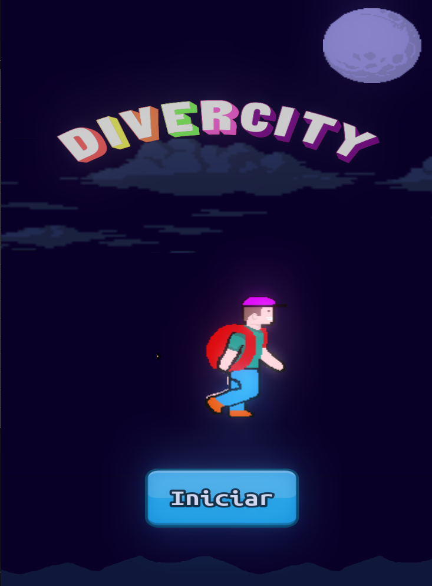
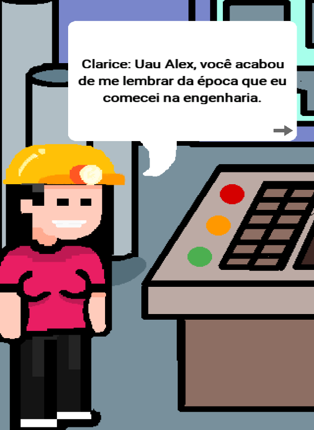
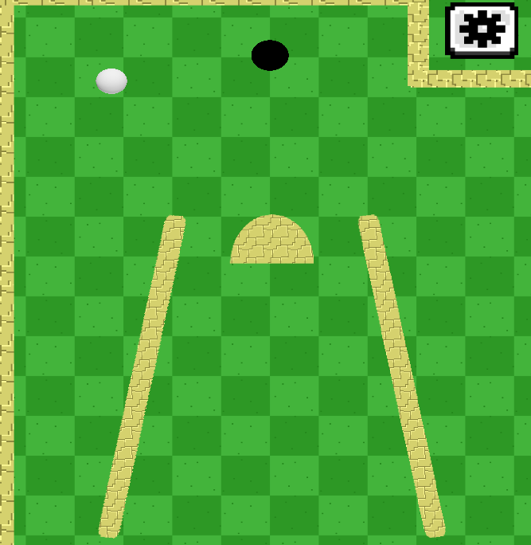
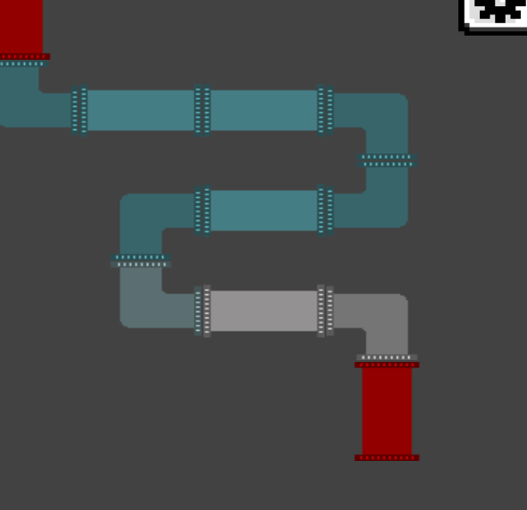

# Inteli - Instituto de Tecnologia e Liderança

<p align="center">
<a href= "https://www.inteli.edu.br/"></a>
</p>

# DiverCity

## InBev

## Integrantes: <a href="https://www.linkedin.com/in/ariel-kisilevzky-7b1770ba/">Ariel Kisilevzky</a>, <a href="https://www.linkedin.com/in/gabriel-torres-233851231/">Gabriel Torres</a>, <a href="https://www.linkedin.com/in/henrique-marlon-6771331ba/">Henrique Marlon</a>, <a href="https://www.linkedin.com/in/izabella-almeida-10">Izabella Almeida</a>, <a href="https://www.linkedin.com/in/mihaell-alves-4ab12720b/">Mihaell Alves</a>, <a href="https://www.linkedin.com/in/valentina-garcia-a015981b8">Valentina Garcia</a>, <a href="https://www.linkedin.com/in/vinicioslugli/">Vinicios Lugli</a>

## Professores Orientadores: 
<a href="http://lattes.cnpq.br/2716416791407528" target="_blank" rel="noopener noreferrer"> Flavio Marques Azevedo </a>, 
<a href="http://lattes.cnpq.br/9324969584977927" target="_blank" rel="noopener noreferrer"> Laíza Ribeiro </a>, 
<a href="http://lattes.cnpq.br/2951162577564329" target="_blank" rel="noopener noreferrer"> Pedro Teberga</a>, 
<a href="http://lattes.cnpq.br/2327073767433655" target="_blank" rel="noopener noreferrer"> Ricardo Missori </a>,
<a href="http://lattes.cnpq.br/3254174044411983" target="_blank" rel="noopener noreferrer"> Victor Bruno Alexander Rosetti de Quiroz </a>

## Descrição

📜 Jogo DIVERCITY, desenvolvido por alunos do Instituto de Tecnologia e Liderança, durante o projeto do primeiro módulo em parceria com a empresa <a href="https://www.ambev.com.br/">Ambev</a>.

📜 Tem como objetivo primordial aumentar a retenção do programa de D&I, oferecido pela empresa Ambev (Companhia de bebidas das Américas), a qual enfrentava problemas de engajamento durante a sua aplicação.<br><br>
<p align="center">

  <br><br>
  Imagem da tela inicial do jogo
</p>


💡 O jogo é composto por um quiz, com perguntas relacionadas a equidade de gênero de raça, e, paralelo a ele, existe um mapa no qual o personagem principal avança conforme o usuário acerta as perguntas propostas.
<br><br>
Nosso projeto ajuda no ensinamento de funcionários da <a href="https://www.ambev.com.br/">ambev</a> sobre diversidade utilizando de meios simples, educativos e interativos.
<br><br>

---

## 🛠 Estrutura de pastas

<b>Projeto 4</b><br>
Documentos<br>
&emsp;|-->antigos<br>
&emsp;|--> GDD grupo 4.pdf <br>
executáveis<br>
&emsp;|--> Windows<br>
&emsp;|--> Android<br>
&emsp;|--> HTML<br>
imagens<br>
src<br>
&emsp;|--> InBev<br>
readme.md<br>
licença.txt <br>

## 🛠 Instalação
<b>Pode ser jogado no browser!:</b>
[Link do projeto WEB](https://vinicioslugli.itch.io/divercity)

<b>Windows:</b>

Não há instalação, apenas executável. Baixe os arquivos disponíveis em https://github.com/2022M1T1/Projeto4/tree/master/execut%C3%A1veis/Windows e execute "1.5.0_DiverCity.exe" como qualquer outro programa.


<b>Android:</b>

Faça o Download do ultimo binário do [jogo](/executáveis/Android), transfira o arquivo `.apk` para o seu dispositivo Android e instale o jogo.
```sh
⚠️ Atenção, caso seu dispositivo afirme que o jogo não possa ser instalado por conta de permissões de fontes externas desconhecidas, aceite as permissões, habilite a autorização de instação de aplicativos de fontes desconhecidas e instale novamente!
```
---

<b>HTML:</b>

Não há instalação! Baixe os arquivos disponíveis em https://github.com/2022M1T1/Projeto4/tree/master/execut%C3%A1veis/HTML/Divercity_1.5.0_html e execute-o como uma página da web (através de algum navegador).

```sh
Dependendo de suas configurações de firewall, talvez seja necessário
instaurar um web service como xampp ou wampp para que o jogo rode lo-
calmente.
```
---
## 📈 Exemplo de uso




---

## 💻 Configuração para Desenvolvimento
Para abrir este projeto você necessita das seguintes ferramentas:

- <a href="https://godotengine.org/download">GODOT</a>

1. Baixe o projeto.
2. Abra o Godot Engine.
3. Selecione a opção "Importar" para importar um projeto.
4. Selecione o arquivo `project.godot` localizado em `src/InBev/` da pasta raiz do projeto.
5. Agora o godot irá importar o jogo e você poderá ter acesso a todo projeto!

---

## 🗃 Histórico de lançamentos
* 1.0.0
  * Primeiro lançamento.
  * Menu simples com animações e sistema de ilumunação ( GLOW ).
  * Cena do jogo simples com primeiras ideias de mapa e movimentação de personagem.

* 1.1.1
  * Adicionado minigame de golfe.
  * Adicionado animação de transição de cenas.
  * Criado gerenciador principal de cenas.

* 1.2.0
  * Refatorado minigame de golfe, mapa principal e transições de cenas.
  * Corrigido falhas de cena não existente (null scenes).
  * Reorganizado arquivos de workspace ( pastas e arquivos ).
  * Adicionado novos pacotes de recursos 2D.

* 1.3.0
  * Adicionado novos pacotes de recursos 2D feitos pelo grupo.
  * Adicionado história inicial do jogo com balões de fala e interação com toques.
  * Implementado novos mapas para o minigame de golfe.
  * Criado base para minigame eletropipe.
  * Refatorado mapa para melhor aproveitamento visual.
  * Adicionado sistema de levels durante o decorrer do jogo.

* 1.4.0
  * Adicionado início trilha de gênero.
  * Implementado mais efeitos sonoros e música de ambiente.
  * Implementado botão de menu configurações.
  * Simples mudanças de interface para melhor usabilidade.
  * Refatoração do mapa de Divercity.

* 1.5.0
  * Finalizado todos os minigames e perguntas.
  * Corrigido bugs e recomendações pelos testes de uso de usuários.
  * Deploy final do projeto (Módulo 1)
---

## 📋 Licença/License

<a rel="cc:attributionURL dct:creator" property="cc:attributionName" href="https://github.com/2022M1T1/Projeto4/blob/master/README.md#InBev">INBEV</a>, by <a rel="cc:attributionURL dct:creator" property="cc:attributionName" href="https://www.yggbrasil.com.br/vr">INTELI, VICTOR BRUNO ALEXANDER ROSETTI DE QUIROZ</a> is licensed under <a href="http://creativecommons.org/licenses/by/4.0/?ref=chooser-v1" target="_blank" rel="license noopener noreferrer" style="display:inline-block;">Attribution 4.0 International</a></p>

---


## 📋 Licença/License


## 🎓 Referências

Aqui estão as referências usadas no projeto.
1. <https://docs.godotengine.org/pt_BR/latest/tutorials/2d/index.html>
2. <https://docs.godotengine.org/en/3.0/tutorials/shading/shading_language.html>
3. <https://github.com/yairm210/Unciv/tree/master/android/Images/TileSets/FantasyHex>
4. <https://freesound.org/>
5. <https://www.zapsplat.com/>
6. <https://github.com/RPicster/Godot-particle-and-vfx-textures/>
7. <https://github.com/uheartbeast/jitter-free-pixelart-scaling/>

