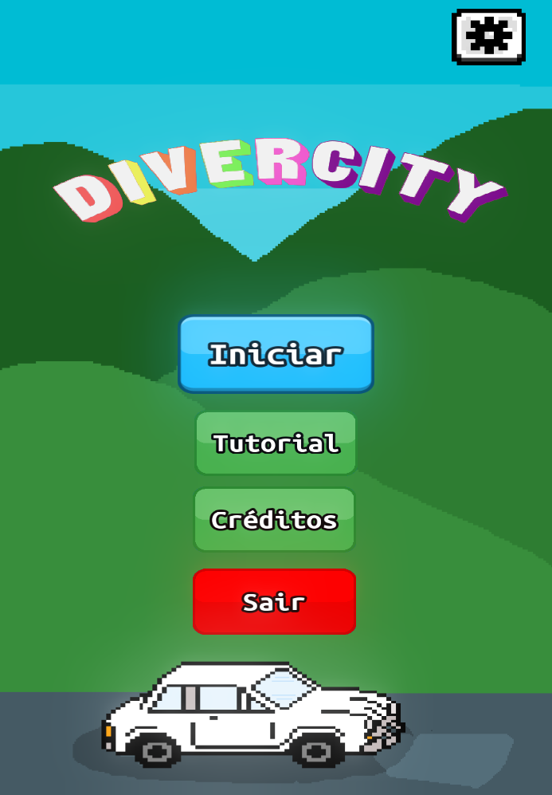

# Inteli - Instituto de Tecnologia e Liderança

# DiverCity

## InBev

## Integrantes: <a href=" https://www.linkedin.com/in/ariel-kisilevzky-7b1770ba/">Ariel Kisilevzky</a>, <a href="https://www.linkedin.com/in/gabriel-torres-233851231/">Gabriel Torres</a>, <a href="https://www.linkedin.com/in/henrique-marlon-6771331ba/">Henrique Marlon</a>, <a href="https://www.linkedin.com/in/izabella-almeida-10">Izabella Almeida</a>, <a href="https://www.linkedin.com/in/mihaell-alves-4ab12720b/">Mihaell Alves</a>, <a href="https://www.linkedin.com/in/valentina-garcia-a015981b8">Valentina Garcia</a>, <a href="https://www.linkedin.com/in/vinicioslugli/">Vinicios Lugli</a>

## Descrição

📜 Jogo DIVERCITY, desenvolvido por alunos do Instituto de Tecnologia e Liderança, durante o projeto do primeiro módulo em parceria com a empresa <a href="https://www.ambev.com.br/">Ambev</a>.

📜 Tem como objetivo primordial aumentar a retenção do programa de D&I, oferecido pela empresa Ambev (Companhia de bebidas das Américas), a qual enfrentava problemas de engajamento durante a sua aplicação.  

    
  Imagem da tela inicial do jogo

💡 O jogo é composto por um quiz, com perguntas relacionadas a equidade de gênero de raça, e, paralelo a ele, existe um mapa no qual o personagem principal avança conforme o usuário acerta as perguntas propostas.
  
Nosso projeto ajuda no ensinamento de funcionários da <a href="https://www.ambev.com.br/">ambev</a> sobre diversidade utilizando de meios simples, educativos e interativos.
  

---

## 🛠 Estrutura de pastas

- 📂 __Projeto4__
   - 📄 [README.md](README.md)
   - 📂 __[documentos](documentos/)__
     - 📄 Arquivos de documentos do projeto
   - 📂 __[executáveis](executáveis/)__
      - 📄 Local onde estão os executáveis do jogo
   - 📂 __[imagens](imagens/)__
      - 📄 Imagens usadas para descrição do projeto
   - 📂 __[src](src/)__ | Projetos
      - 📂 __[InBev](src/InBev)__ | Projeto GODOT principal
        - 📂 __[resources](src/InBev/resources)__
          - 📄 Materiais usados para a criação
        - 📂 __[scenes](src/InBev/scenes)__
          - 📄 Cenas contidas do jogo
        - 📂 __[sources](src/InBev/sources)__
          - 📄 Código fonte do jogo

---

## 🛠 Instalação
<b>Pode ser jogado no browser!:</b>
[Link do projeto WEB](https://vinicioslugli.itch.io/divercity)

<b>Android:</b>

Faça o Download do ultimo binário do [jogo](/executáveis/Android), transfira o arquivo `.apk` para o seu dispositivo Android e instale o jogo.

⚠️ Atenção, caso seu dispositivo afirme que o jogo não possa ser instalado por conta de permissões de fontes externas desconhecidas, aceite as permissões, habilite a autorização de instação de aplicativos de fontes desconhecidas e instale novamente!

---

## 📈 Exemplo de uso
### WIP
---

## 💻 Configuração para Desenvolvimento
Para abrir este projeto você necessita das seguintes ferramentas:

- <a href="https://godotengine.org/download">GODOT</a>

1. Baixe o projeto.
2. Abra o Godot Engine.
3. Selecione a opção "Importar" para importar um projeto.
4. Selecione o arquivo `project.godot` localizado em `src/InBev/` da pasta raiz do projeto.
5. Agora o godot irá importar o jogo e você poderá ter acesso a todo projeto!

---

## 🗃 Histórico de lançamentos
* 1.0.0
  * Primeiro lançamento.
  * Menu simples com animações e sistema de ilumunação ( GLOW ).
  * Cena do jogo simples com primeiras ideias de mapa e movimentação de personagem.

* 1.1.1
  * Adicionado minigame de golfe.
  * Adicionado animação de transição de cenas.
  * Criado gerenciador principal de cenas.

* 1.2.0
  * Refatorado minigame de golfe, mapa principal e transições de cenas.
  * Corrigido falhas de cena não existente (null scenes).
  * Reorganizado arquivos de workspace ( pastas e arquivos ).
  * Adicionado novos pacotes de recursos 2D.

* 1.3.0
  * Adicionado novos pacotes de recursos 2D feitos pelo grupo.
  * Adicionado história inicial do jogo com balões de fala e interação com toques.
  * Implementado novos mapas para o minigame de golfe.
  * Criado base para minigame eletropipe.
  * Refatorado mapa para melhor aproveitamento visual.
  * Adicionado sistema de levels durante o decorrer do jogo.

* 1.4.0
  * Adicionado início trilha de gênero.
  * Implementado mais efeitos sonoros e música de ambiente.
  * Implementado botão de menu configurações.
  * Simples mudanças de interface para melhor usabilidade.
  * Refatoração do mapa de Divercity.
---

## 📋 Licença/License

<a property="dct:title" rel="cc:attributionURL" href="https://github.com/Spidus/Teste_Final_1">MODELO GIT INTELI</a> by <a rel="cc:attributionURL dct:creator" property="cc:attributionName" href="https://www.yggbrasil.com.br/vr">INTELI, VICTOR BRUNO ALEXANDER ROSETTI DE QUIROZ</a> is licensed under <a href="http://creativecommons.org/licenses/by/4.0/?ref=chooser-v1" target="_blank" rel="license noopener noreferrer" style="display:inline-block;">Attribution 4.0 International</a>

---

## 🎓 Referências

Aqui estão as referências usadas no projeto.
1. <https://docs.godotengine.org/pt_BR/latest/tutorials/2d/index.html>
2. <https://docs.godotengine.org/en/3.0/tutorials/shading/shading_language.html>
3. <https://github.com/yairm210/Unciv/tree/master/android/Images/TileSets/FantasyHex>
4. <https://freesound.org/>
5. <https://www.zapsplat.com/>
6. <https://github.com/RPicster/Godot-particle-and-vfx-textures/>
7. <https://github.com/uheartbeast/jitter-free-pixelart-scaling/>

